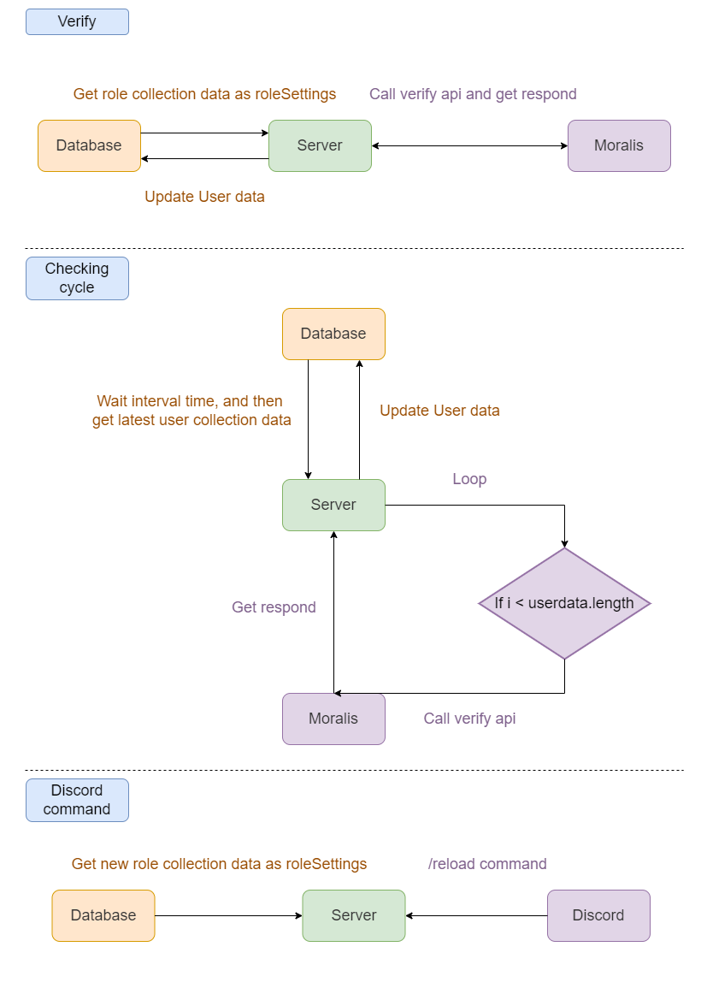
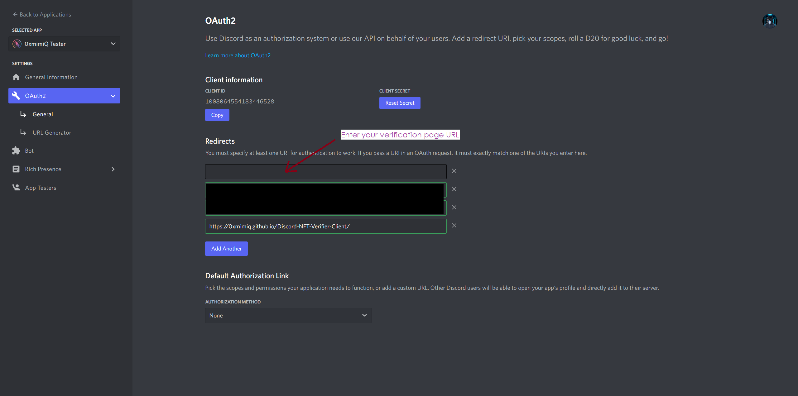
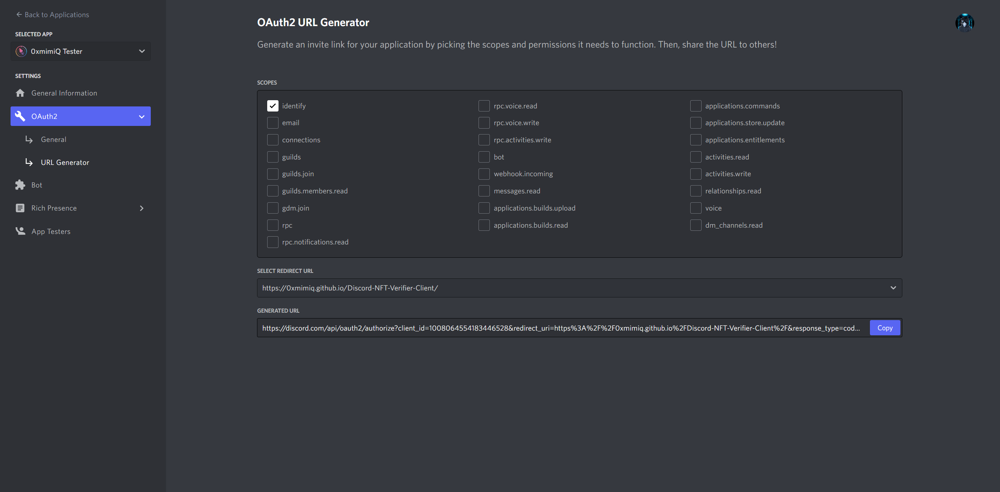
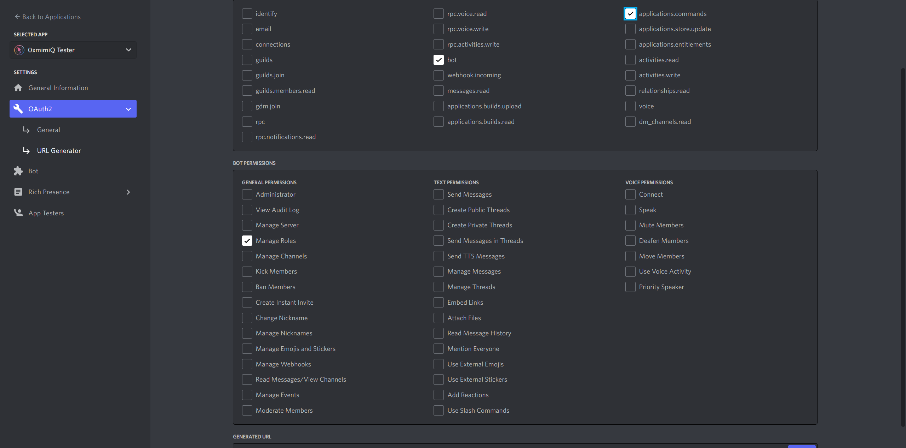

# Discord NFT Verifier - Server

<a href="https://github.com/0xmimiQ/Discord-NFT-Verifier-Server/blob/main/README.md"></a> &nbsp;<a href="https://github.com/0xmimiQ/Discord-NFT-Verifier-Server/blob/main/doc/README_CN.md"></a> &nbsp;<a href="https://github.com/0xmimiQ/Discord-NFT-Verifier-Server/blob/main/doc/README_JP.md"></a>

> 源碼

- [**Client**](https://github.com/0xmimiQ/Discord-NFT-Verifier-Client)
- [**Server**](https://github.com/0xmimiQ/Discord-NFT-Verifier-Server)

<br />

> 概述

此機器人提供 NFT 驗證功能，當使用者透過前端驗證後，將會取得由開發者設定的對應身分組。並且將會每一段時間自動檢驗一次。相關設定開發者可透過本地或雲端資料庫操作，本機器人使用 MongoDB - Atlas。

**※本機器人未實作在多個 Discord Guild 運作，但這部分功能可以很簡易的透過增添 role collection 的 guild id 欄位以及修改相關的 code 來添加。**

<br />

## Architecture & Technology

> 產品架構及相關技術

### - Client

> Using: React + Tailwindcss

- 使用者透過 discord 驗證連結跳轉至本服務前端驗證頁面，當連結錢包後，即會送出資訊至後端等待驗證結果。收到結果之後顯示驗證結果給使用者。


<br />

### - Server

> Using: Express + MongoDB Atlas + DiscordJS

- 收到來自前端的用戶資訊(discord 相關以及錢包地址)之後，\*併發呼叫 Moralis API，確認用戶的錢包中是否包含開發者所設定的代幣合約，根據前述來決定是否給予用戶身分組。
- 每一段週期重新檢驗一次已驗證的用戶錢包，來決定是否要新增或拔除用戶身分組。
- 開發者可以透過修改資料庫設定，來變動 role settings。
- 提供 Discord Slash Command(/reload)來隨時加載新的 role settings。

**併發 - 為了追求速度使用併發呼叫，免費 API 有一秒請求 25 筆的限制，因此若您使用免費 API，請控制合約數量在 25 以內，否則須自行修改 code，以分組形式分批驗證。**



<br />

## Setup

> 1. 設定 Discord 機器人相關設定。(※您必須給予本機器人能給予的身分組權限還要高的身分組，否則將無法運作。)

### - 添加 Discord 驗證 API 跳轉頁(您的驗證系統首頁)



### - 選擇上面添加的驗證頁 URL 來生成驗證 URL 提供用戶做驗證使用



記得必須將產生出來的 url 中的`code`字串替換成`token`

### - 打開特權網關意圖


### - 勾選類型及權限產生機器人邀請連結，之後將機器人邀請至您的 Guild



<br />

> 2. 設置資料庫，這邊利用的是 MongoDB - Atlas。

### - 配置 role

在您想要用來連線的 database 下，建立`role`這個名稱的 collection，以下面這種形式 insert 一筆 document：

```json
{
  "tokenAddress": "0x0C5cEA99fEd27c98B505837A8E72cfDF70bcF8F0",
  "roles": [
    {
      "roleName": "Kaiju VIP", // Discord role name
      "roleId": "932197370173718578", // Discord role id
      "requiredAmount": {
        "$numberInt": "1"
      }
    },
    {
      "roleName": "Special Kaiju VIP",
      "roleId": "989098089216376832",
      "requiredAmount": {
        "$numberInt": "3"
      }
    }
  ]
}
```

<br />

當您想要讓已添加的合約增添身分組，直接在陣列內以下方格式添加即可：

```json
{
  "roleName": "role name",
  "roleId": "discord role id",
  "requiredAmount": {
    "$numberInt": ">=0 number"
  }
}
```

**添加後記得必須在 discord 輸入`/reload`來載入新設定，或是 server 重開。**

<br />

> 3. 建立客戶端與伺服器端的資料夾，之後分別在各自的資料夾執行 `git clone`，將倉庫的檔案複製下來，然後執行 npm 指令。最後透過反向代理伺服器部署成生產環境。您也可以基於測試目的直接執行 `npm start`。

<br />

### - Client 資料夾

```sh
mkdir <projectfolderForClient> && cd <projectfolderForClient>
git clone https://github.com/0xmimiQ/Discord-NFT-Verifier-Client
npm install
```

<br />

將`./src/App.js`中的`verifyApiUrl`更改為您的後端 API Url。

```javascript
const verifyApiUrl = "https://verify.0xmimiq.me";
```

<br />

之後運行：

```sh
npm run build
```

### - Server 資料夾

```sh
mkdir <projectfolderForServer> && cd <projectfolderForServer>
git clone https://github.com/0xmimiQ/Discord-NFT-Verifier-Server
npm install
```

<br />

將`./src/_configs.json`更名為`./src/configs.json`，並修改檔案參數為您的參數：

```json
{
  "clientURL": "", // It's your verify page url
  "serverPort": 11111,
  "mongoDBUri": "mongodb+srv://<UserName>:<Password>@cluster0.badrclk.mongodb.net/<DatabaseName>",
  "discord": {
    "ownerId": "",
    "token": "",
    "guildId": "", // The bot is going to run discord guild id
    "logChannelId": "", // A log channel id in the guild above
    "checkUserCycleTime": 1200000 // Check wallet cycle interval time in ms
  },
  "moralis": {
    // Apply API key in https://moralis.io/
    "apiKey": "",
    "logLevel": "info",
    "formatEvmChainId": "decimal",
    "formatEvmAddress": "checksum"
  }
}
```

### - 設置反向代理伺服器

利用像是[Nginx](https://www.nginx.com/)等反向代理伺服器，做相關參數設定即可運行。

參考如何部屬您的檔案至 Nginx 上：

- https://www.youtube.com/watch?v=6CjbezdbB8o
- https://help.clouding.io/hc/en-us/articles/4407785919762-How-to-Deploy-a-React-js-App-with-Nginx-on-Ubuntu-20-04

<br />

## Demo

> 驗證頁及 Discord 中的更新展示

- [**Static verify page**](https://0xmimiq.github.io/Discord-NFT-Verifier-Client/)
- [**Discord demo**](./img/discordDemo.png)

<br />

## Reference

### - Client

- [**React**](https://reactjs.org/)
- [**Tailwindcss**](https://tailwindcss.com/docs/installation)

### - Server

- [**ExpressJS**](https://github.com/expressjs/express)
- [**DiscordJS**](https://discord.js.org/#/docs/discord.js/main/general/welcome)
- [**MongoDB Atlas**](https://www.mongodb.com/docs/atlas/)
- [**Moralis**](https://moralis.io/)

<br />

## License

所有包含：

- Kaiju of Cronos
- クロノスの怪獣

等文字或相關圖像之一切藝術資產，包括但不限於`Logo`, `Banner`, `Background`皆為`Kaiju of Cronos`所有，保留所有權，禁止未經授權以原樣或再製使用。

其餘非上述所限制之藝術或程式碼資產，採用 [Apache-2.0 License](LICENSE)。
