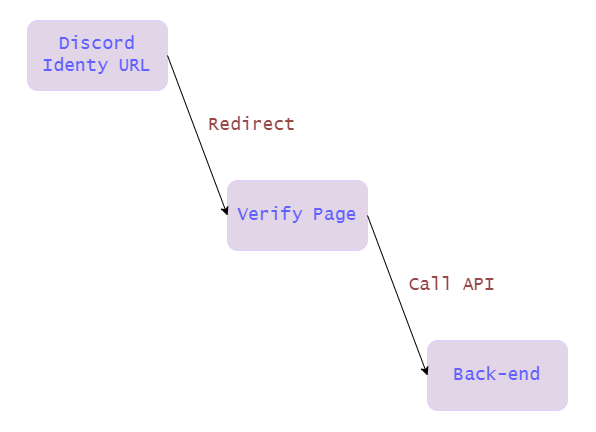
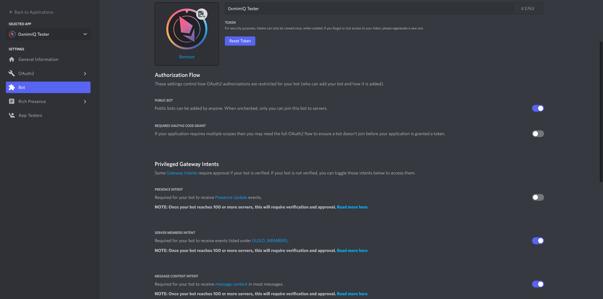

# Discord NFT Verifier - Server

<a href="https://github.com/0xmimiQ/Discord-NFT-Verifier-Server/blob/main/README.md"></a> &nbsp;<a href="https://github.com/0xmimiQ/Discord-NFT-Verifier-Server/blob/main/doc/README_CN.md"></a> &nbsp;<a href="https://github.com/0xmimiQ/Discord-NFT-Verifier-Server/blob/main/doc/README_JP.md"></a>

> ソースコード

- [**Client**](https://github.com/0xmimiQ/Discord-NFT-Verifier-Client)
- [**Server**](https://github.com/0xmimiQ/Discord-NFT-Verifier-Server)

<br />

> 概要

このボットの目的は、NFT 認証です。 ユーザーがフロントエンドを通じてウォレットにコネクトすると、開発者が設定した対応する discord のロールが取得されます。 また、一定期間ごとに自動的にチェックされます。 設定は、開発者がローカルに設定することも、クラウドのデータベースで操作することも可能で、このボットには MongoDB - Atlas が使われています。

**※このボットは複数の Discord ギルド間で働くことはできませんが、この部分は role collection にギルド ID フィールドを追加し、関連するコードを変更することで簡単に追加することができます。**

<br />

## Architecture & Technology

> プロダクトのアーキテクチャと関連技術

### - Client

> Using: React + Tailwindcss

- ユーザーは、discord の認証リンクからサービスのフロントエンドの認証ページにリダイレクトされます。 ウォレットがリンクされると、バックエンドに情報が送信され、認証結果を待ちます。 結果を受信すると、その結果がユーザーに示されます。



<br />

### - Server

> Using: Express + MongoDB Atlas + DiscordJS

- フロントエンドからユーザー情報（discord 関連とウォレットアドレス）を受け取ったサーバーは、Moralis API を呼び出してユーザーのウォレットに開発者が設定したトークンコントラクトが含まれているかどうかを確認し、それに基づいてユーザーにロールを与えるかどうかを決めます。
- 認証されたユーザーウォレットは一定期間ごとに再確認され、ユーザーロールの追加・削除が決まります。
- 開発者は、データベースの設定を変更することで、role settings を変更することができます。
- 新しい role settings をいつでもロードできるように、Discord Slash Command(/reload)が提供されています。

**並行呼び出し - 速度を上げるために並行呼び出しを使用します。 無料 API では 1 秒間に 25 リクエストという制限があるので、無料 API を使う場合はコントラクト数を 25 以下にしないと、自分でコードを変更してグループで分けて検証しなければなりません。**


<br />

## Setup

> 1. Discord ボットの設定を行います。 (※このボットが他人に与えることのできるロールよりも高い権限を持つロールを与える必要があり、そうでない場合は作動しません)

### - Discord 認証 API のリダイレクトページを追加する（認証システムのトップページ）


### - 上記で追加した認証ページ URL を選択し、ユーザーが認証に使用するための認証 URL を生成します


生成された URL の `code` は `token` に変更することを忘れないようにください。

### - 特権ゲートウェイのインテントをオープンする



### - スコープと特権を選択して、ボット招待リンクを生成し、ボットをギルドに招待します。


<br />

> 2. データベースを設定する。 こちらでは、MongoDB - Atlas を使用しています。

### - ロールの設定

接続に使用するデータベースの下に `role` という名前のコレクションを作成し、以下のような形式のドキュメントを挿入します。

```json
{
  "tokenAddress": "0x0C5cEA99fEd27c98B505837A8E72cfDF70bcF8F0",
  "roles": [
    {
      "roleName": "Kaiju VIP", // Discord role name
      "roleId": "932197370173718578", // Discord role id
      "requiredAmount": {
        "$numberInt": "1"
      }
    },
    {
      "roleName": "Special Kaiju VIP",
      "roleId": "989098089216376832",
      "requiredAmount": {
        "$numberInt": "3"
      }
    }
  ]
}
```

<br />

また、すでに追加したコントラクトにロールを追加したい場合は、以下のような形式で配列に追加してください。

```json
{
  "roleName": "role name",
  "roleId": "discord role id",
  "requiredAmount": {
    "$numberInt": ">=0 number"
  }
}
```

**追加後、新しい設定をロードするために、Discord で`/reload`を入力することを忘れないでください。 または、サーバーを再起動してもいいです。**

<br />

> 3. client フォルダと server フォルダを作成し、それぞれのフォルダで `git clone` を実行してリポジトリからファイルをコピーし、npm のコマンドを実行します。 最後に、リバースプロキシサーバーを使って本番環境を配備します。 また、テスト用に直接 `npm start` を実行することも可能です。

<br />

### - Client フォルダ

```sh
mkdir <projectfolderForClient> && cd <projectfolderForClient>
git clone https://github.com/0xmimiQ/Discord-NFT-Verifier-Client
npm install
```

<br />

`.src/App.js`の`verifyApiUrl`をバックエンドの API Url に変更します。

```javascript
const verifyApiUrl = "verify.0xmimiq.me";
```

<br />

そして、以下を実行します。

```sh
npm run build
```

### - Server フォルダ

```sh
mkdir <projectfolderForServer> && cd <projectfolderForServer>
git clone https://github.com/0xmimiQ/Discord-NFT-Verifier-Server
npm install
```

<br />

`.src/_configs.json`の名前を`./src/configs.json`に変更します。そして、ファイル内のパラメータを使用しているものに変更します。

```json
{
  "clientURL": "", // It's your verify page url
  "serverPort": 11111,
  "mongoDBUri": "mongodb+srv://<UserName>:<Password>@cluster0.badrclk.mongodb.net/<DatabaseName>",
  "discord": {
    "ownerId": "",
    "token": "",
    "guildId": "", // The bot is going to run discord guild id
    "logChannelId": "", // A log channel id in the guild above
    "checkUserCycleTime": 1200000 // Check wallet cycle interval time in ms
  },
  "moralis": {
    // Apply API key in https://moralis.io/
    "apiKey": "",
    "logLevel": "info",
    "formatEvmChainId": "decimal",
    "formatEvmAddress": "checksum"
  }
}
```

### - リバースプロキシサーバーを設置する

[Nginx](https://www.nginx.com/)などのリバースプロキシサーバを使用し、パラメータを設定して実行します。

Nginx にファイルを配置する方法はこちらをご覧ください。

- https://www.youtube.com/watch?v=6CjbezdbB8o
- https://help.clouding.io/hc/en-us/articles/4407785919762-How-to-Deploy-a-React-js-App-with-Nginx-on-Ubuntu-20-04

<br />

## Demo

> 認証ページと Discord での更新の表示

- [**Static verify page**](https://0xmimiq.github.io/Discord-NFT-Verifier-Client/)
- [**Discord demo**](./img/discordDemo.png)

<br />

## Reference

### - Client

- [**React**](https://reactjs.org/)
- [**Tailwindcss**](https://tailwindcss.com/docs/installation)

### - Server

- [**ExpressJS**](https://github.com/expressjs/express)
- [**DiscordJS**](https://discord.js.org/#/docs/discord.js/main/general/welcome)
- [**MongoDB Atlas**](https://www.mongodb.com/docs/atlas/)
- [**Moralis**](https://moralis.io/)

<br />

## License

以下の文字または派生イメージを含む（ただしこれに限定されない）「ロゴ」「バナー」「背景」を含むすべてのアートアセットは、「Kaiju of Cronos」が所有し、すべての権利は保有されている。 無断での原形使用、複製を禁止する。

- Kaiju of Cronos
- クロノスの怪獣

上記以外の部分は、[Apache-2.0 License](LICENSE)が使用されています。
